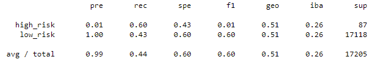
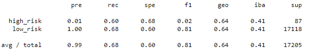
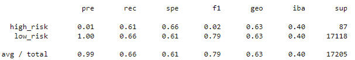
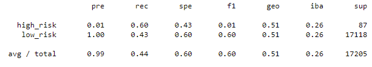
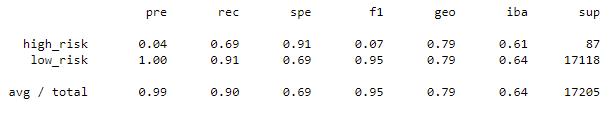
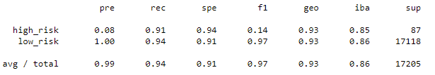

# Challenge_17

## Overview of the analysis

Using the credit card dataset from the Lending Club, we want to get the best possible model to classify new applications as low or high risk based on their specific characteristics.

Notice that, since low-risk requests are a small portion of the total requests, this is, by definition, an unbalanced basis, thus, we'll need to apply some techniques to rebalance the basis to enhance the model's accuracy. 

Finally, to identify the best model among the different options, we'll use the Balanced Accuracy Score, the Precision and Recall Scores.

## Results

To accomplish our duty, we created 6 different models with different results shown below: 

### Undersampling

### Oversampling

#### Naive Random

### SMOTE Oversampling

### Combination 

### Ensemble

### Adaboost

# Summary:
There is a summary of the results
There is a recommendation on which model to use, or there is no recommendation with a justification
